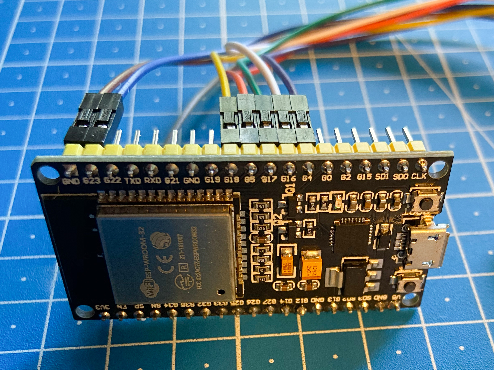

# ePaperDisplay
ePaperDisplay is an ESP32 firmware to periodically update an e paper display with image data from the network. It was built as a companion project to [what-to-wear](https://github.com/dschanoeh/what-to-wear) - a server that generate a "smart" weather report.

Compared to other projects, it doesn't render e.g. a weather dashboard locally but simply retrieves an image. This allows for more complex (and convenient) image generation on the server.
The firmware will be in deep sleep between updates which should enable battery-powered setups.

The firmware was built for the [Waveshare 7.5inch e-Paper HAT](https://www.waveshare.com/wiki/7.5inch_e-Paper_HAT) and an [ESP32 NodeMCU board](https://www.az-delivery.de/en/collections/wifi-module/products/esp32-developmentboard) and only tested with these. Other displays and boards can likely be supported with small modifications.

## Installation

### Prerequisites

The following external components need to be set up:

1. An MQTT broker
2. A content-generating component publishing image data and adhering to the [protocol](./documentation/Protocol.md)

### Building the Firmware

This repository must be built using [PlatformIO](https://platformio.org/) and flashed onto the device.

If necessary, the software and hardware configuration can be modified in [main.h](./src/main.h) prior to building.

Afterwards, WiFi and MQTT settings must be added to [config.json](./data/homie/config.json) and also flashed onto the device (see the [Homie documentation](https://homieiot.github.io/homie-esp8266/docs/stable/configuration/json-configuration-file/) for more information).

### Wiring

The following images show the default wiring. When modifying the wiring, adjustments need to be made to main.h.

A close-up on the ESP32. The only pin used on the other side is the 3V3 supply.

## Under the Hood
The firmware builds on top of [Homie](https://github.com/homieiot/homie-esp8266) for general MQTT and state handling as well as OTA updates. Therefore, it can easily be extended with additional functionality (sensors, buttons, ...).

The communication with the display is realized using a modified version of the Waveshare example code (with some bugs fixed). It can be found in the waveshare directory.
